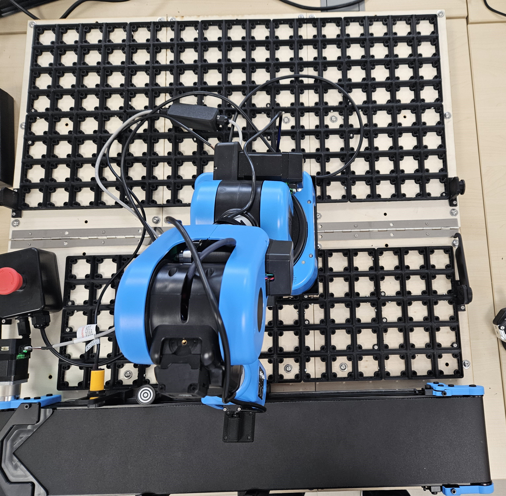

# Transfert de prièce

## Fonctionnement

L'utilisateur doit d'abord placer le robot à l'emplacement lié à la démonstration comme ci-dessous. 

Par la suite, il faut placer les 3 plaques qui recevront les objets triés.

## Matériel

Pour ce module, nous avons besoin :
 -  Un convoyeur qui va amener les objets au bras robot
 -  Le bras robot
 -  Des capteurs pour la couleur et la forme des objets
 -  Des boîtes de rangement pour les objets triés