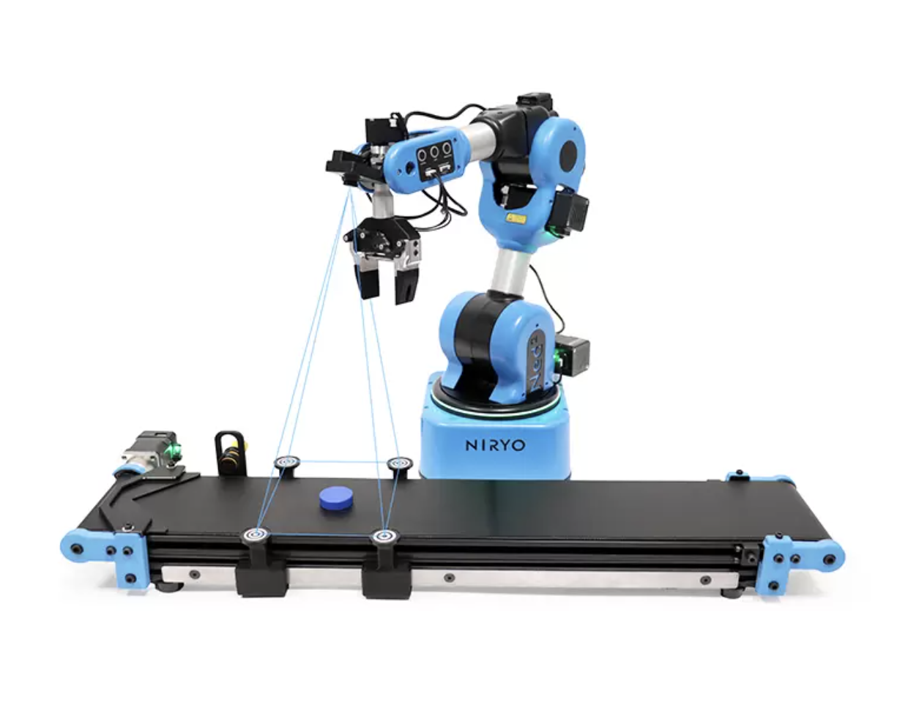

# Chaîne de Tri
Cette application est la première idée que nous avons eu en commençant le projet.

## Fonctionnement

L'utilisateur saisit, grâce au système de gestion des modules, la façon dont il veut trier les objets (forme et/ou couleur). Ensuite, les objets défilent sur un tapis roulant afin d'être trier par le niryo.

## Matériel

Pour ce module, nous avons besoin :
 -  Un convoyeur qui va amener les objets au bras robot
 -  Le bras robot
 -  Des capteurs pour la couleur et la forme des objets
 -  Des boîtes de rangement pour les objets triés

## Le kit Vision de Niryo

Niryo met en vente beaucoup d'accessoires pouvant compléter le bras robot, parmis ceux-ci, nous retrouvons le kit Vision

 

Le kit Vision nous permet de faire de la reconnaissance de forme et de couleur, parfait pour notre module.
Le kit vision comprend :
 -  Une zone de travail
 -  Une caméra
 -  Des objets à manipuler
 -  Une pointe de précision

La zone de travail est une zone créée par 4 "balises" permettant à la caméra de se repérer

## Et après le tri ?

L'utilisateur renseigne donc la façon dont il veut trier ses objets et le bras fait tout le reste. Les objets lui sont amenés via un convoyeur et il les range ensuite dans leur boîtes attitrées.
Par exemple, si l'utilisateur veut trier les objets par couleur et ne garder que la couleur verte alors, il aura besoin de deux contenant : un pour les objets vert, et un pour le reste.

*Source : https://niryo.com/fr/produits-cobots/ensemble-de-vision-ned2/*