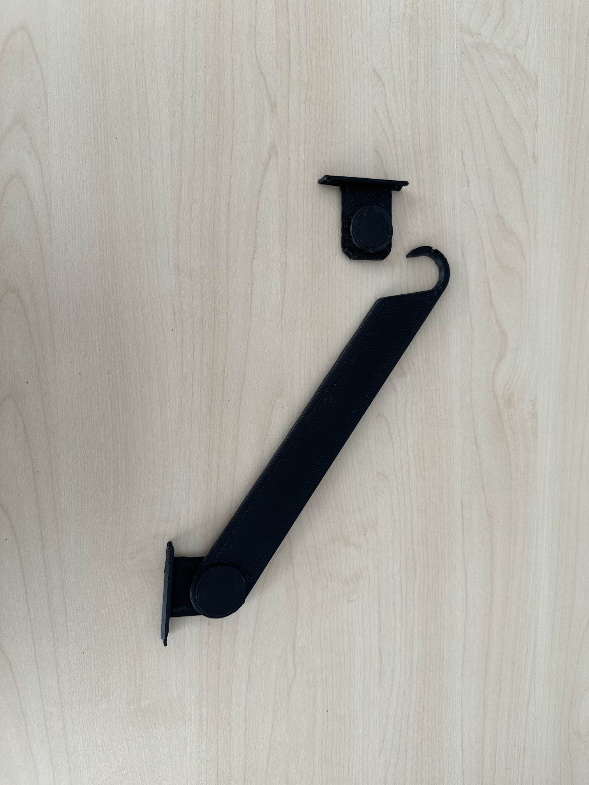

## Première tentative

Notre crochet était malheureusement trop long pour qu'il puisse se glisser sur le support que l'on peut voir sur l'image ci-dessus.
De plus, certaines liaisons n'ont pas été parfaitement dimensionnées, nous avonc dû ajuster le tir sur la seconde tentative afin d'obtenir un glissement parfait et un bon maintien des cotés de la mallette lors de sa fermeture par le biais des crochets.

## Seconde tentative

Sur cette itération finale, nous avons pris la décision de faire un crochet allongé avec un creux parrallèle à la plaque inférieure de la mallette afin de faciliter l'emboîtement des deux pièces tout en s'assurant du maintien de la plaque latérale.
