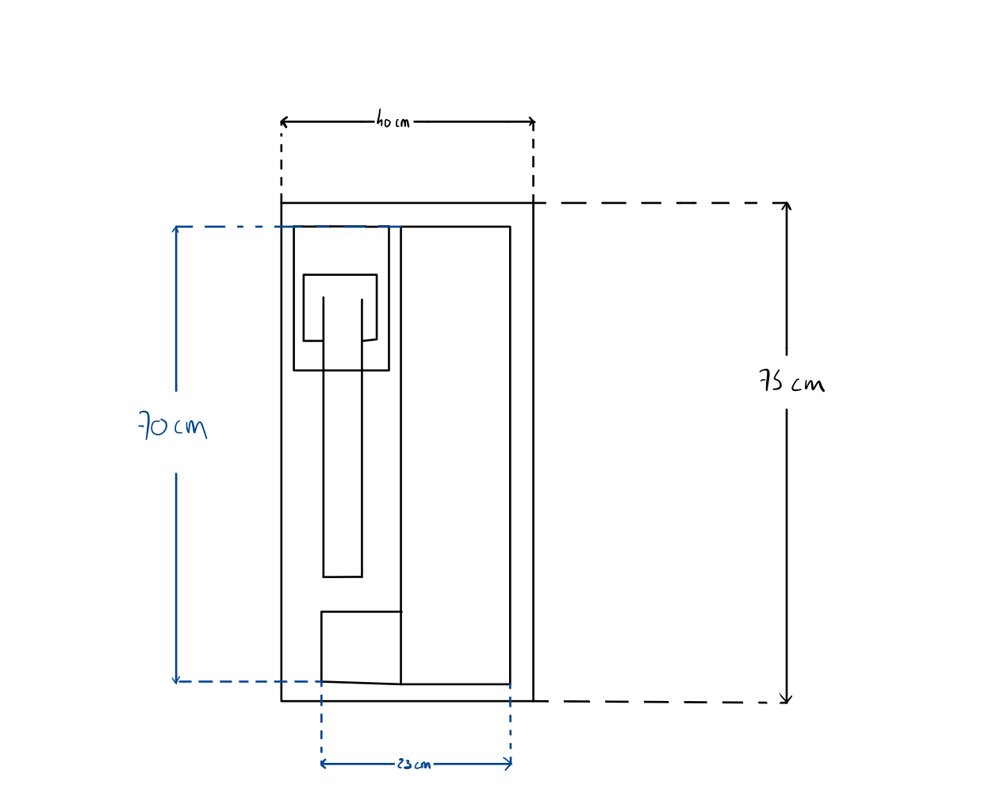
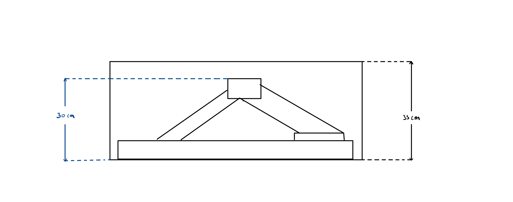
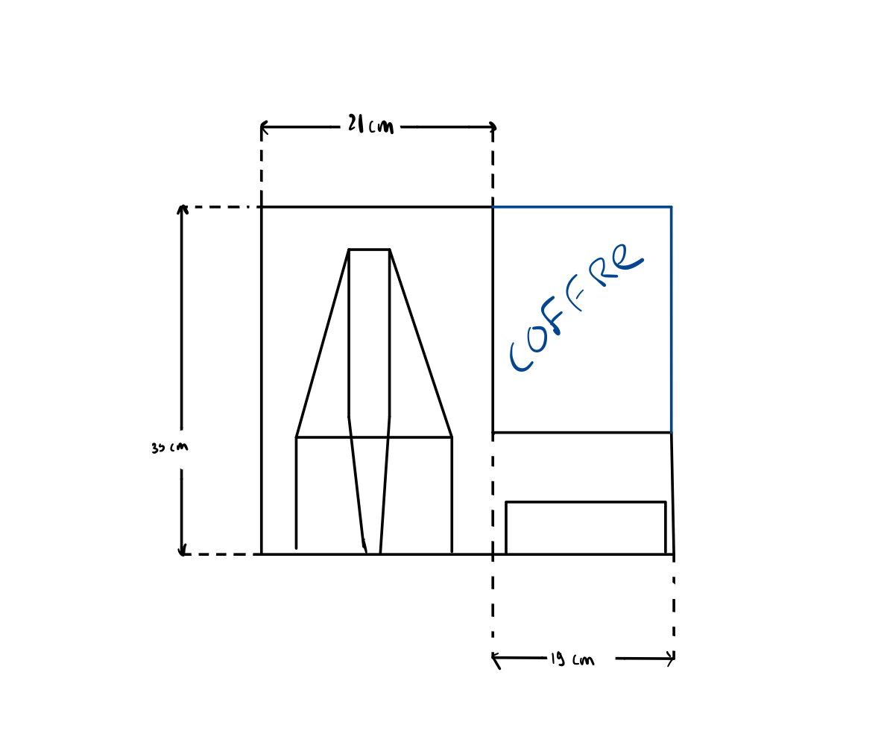
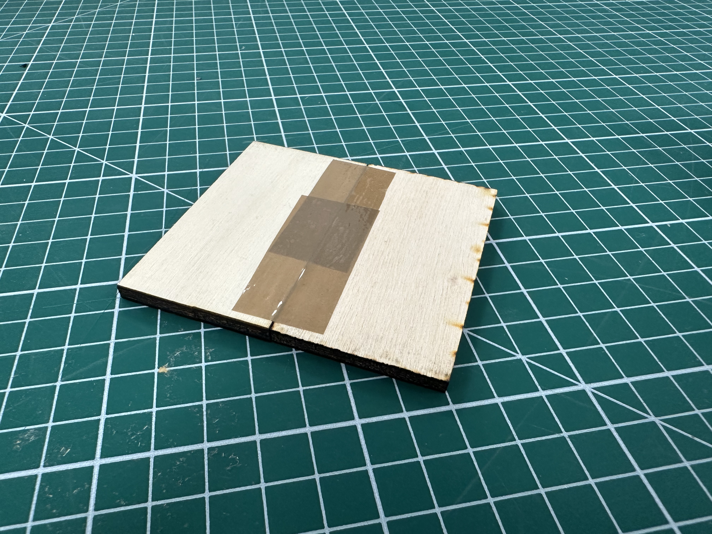
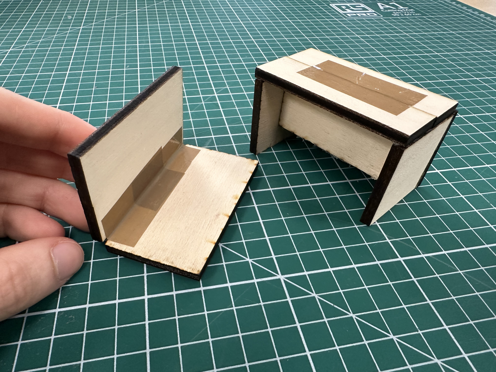
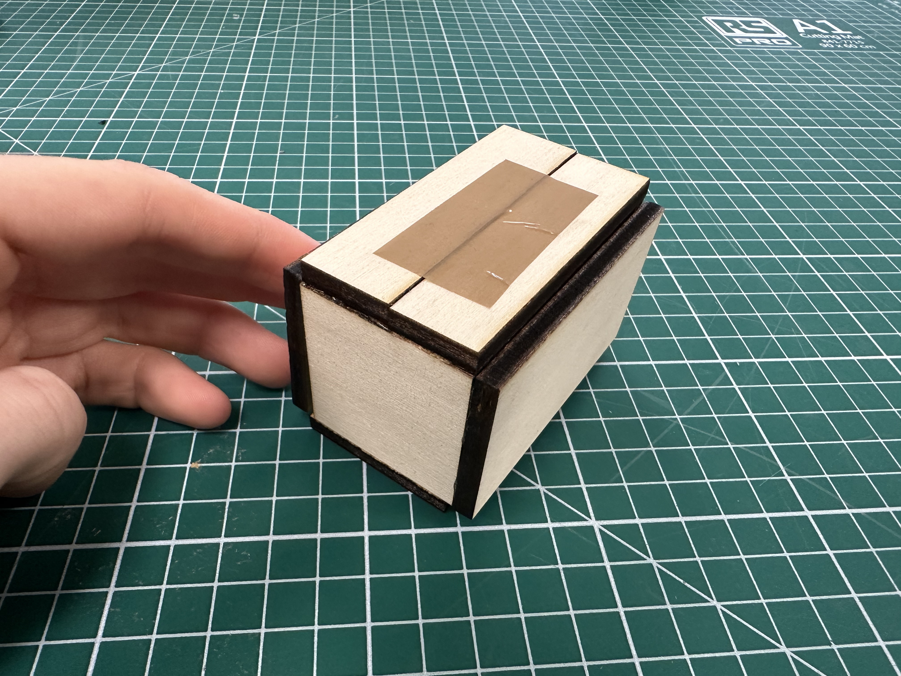
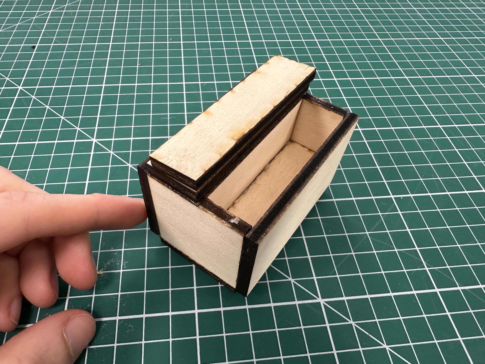

# Mallette 3

## Croquis

---

## Modèle 3D

<model-viewer
    id="viewer"
    alt="Modèle 3D du bras robot Niryo Ned 2"
    src="../shared-assets/models/3D_REPRESENTATION.gltf"
    poster="../shared-assets/images/3D_REPRESENTATION.png"
    shadow-intensity="1"
    camera-controls
    touch-action="pan-z"
    rotation="0 0 90">
</model-viewer>

---

## Prototypage

Nous avons réalisé un prototype à l'échelle 1/10 des dimensions souhaitées pour le prototype final.
Ce prototype nous permettra d'éviter des erreurs futures lors de la conception. En effet, on a constaté qu'il manquait les coins sur les longueurs de la boîte.
On ajustera donc les dimensions du prototype final pour pouvoir obtenir un rectangle régulier.
Seul un côté restera sans coin, celui de la liaison des deux parties du socle puisque celles-ci doivent pouvoir s'aligner côte à côte.

Photo du socle déplié, le scotch représente la charnière permettant la rotation des deux parties.

Photo du socle et du couvercle séparé.

Photo de la boîte fermée lorsque le couvercle est posé sur le socle. Sur ce prototype, rien ne permet d'attacher le socle et le couvercle ensemble mais sur le prototype final ce sera fait grâce à des [sauterelles](../conception/supportCharniere.md).

Photo de la boîte avec le couvercle du coffre ouvert, ici aussi le scotch fais office de charnière.

