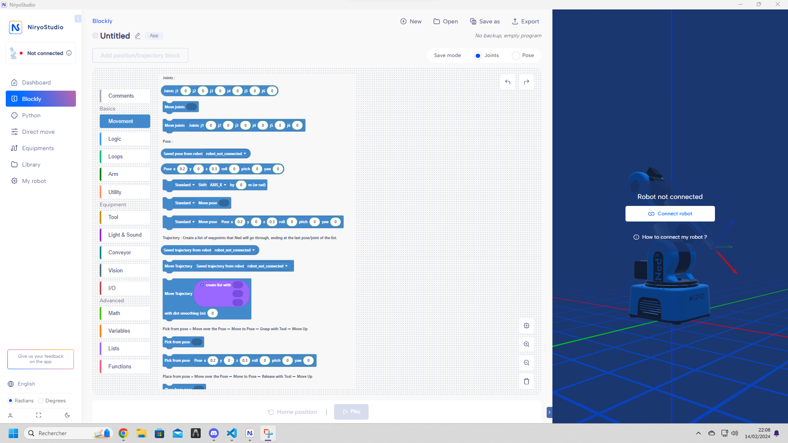
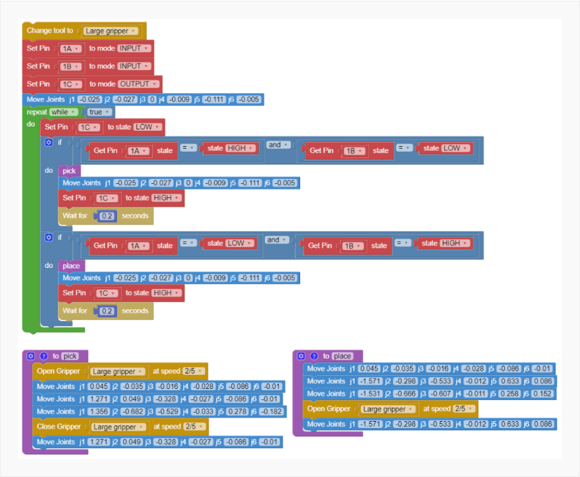

# Comment contrôler le bras Niryo ?

Nous pouvons contrôler le bras robot grâce à un logiciel disponible gratuitement et conçu spécialement pour l'utilisation du bras.

Cette application a été conçu pour faciliter l'utilisation et la configuration du bras Niryo.
Il est possible de le programmer avec le langage *Blockly* qui est un langage d'assemblage de blocs.

Le robot est également configurable, via l'application, avec le langage python.

## Quelle solution allons-nous choisir ?

Nous pensons que l'utilsation du langage *Blockly* et l'envoi d'information par signal électrique représente la meilleure option pour nous.
En effet, nous souhaitons réaliser une maquette pouvant servir pour plusieurs applications. De ce fait, si nous prenons l'exemple de 2 applications différentes, il suffirait de relier une pin d'une carte électronique au robot Niryo. Selon le signal envoyé par la pin (haut ou bas) nous pouvons gérer l'action effectuée par le robot via *Blockly*.

*Source : [https://docs.niryo.com/applications/ned/v1.0.3/en/source/tutorials/control_ned_arduino.html](https://docs.niryo.com/applications/ned/v1.0.3/en/source/tutorials/control_ned_arduino.html)*
