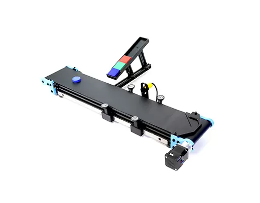

# Bras robotisé Niryo Ned 2 et ses accessoires

## Modèle 3D du bras robot Niryo Ned 2

<model-viewer 
    id="viewer" 
    alt="Modèle 3D du bras robot Niryo Ned 2" 
    src="../shared-assets/models/Bras_Ned_2.gltf" 
    poster="../shared-assets/images/capture_niryo.jpg" 
    shadow-intensity="1" 
    camera-controls 
    touch-action="pan-z"
    rotation="90 90 90">
</model-viewer>

## Présentation 

Le bras robot [Niryo Ned 2](https://niryo.com/fr/produits-cobots/ned-robot-collaboratif-six-axes/) est un cobot développé par la société [Niryo Robotics](https://niryo.com/fr/a-propos/).
Ce robot est accompagné de plusieurs composants. Nous aurons accès au convoyeur et le kit vision lié. 

Premièrement, le convoyeur est un tapis roulant nous permettant de mouvoir des objets. Cet objet va nous servir a déplacer les objets et simuler une chaine de production a vitesse constante. De plus, la vitesse réglable du tapis peux nous permettre de varier les exercices. 

Source : [Convoyeur Niryo](https://niryo.com/fr/produits-cobots/tapis-roulant/)

Deuxièmement, le kit vision fourni est un capteur que l'on fixe au niveau de la tête du bras robotisé. Ce dernier permet la détection des formes et des couleurs et nécessite un unique branchement sur le bras Niryo pour fonctionner ce qui apporte aucun désagrément sur sa portabilité.

Source : 

L'intégralité de ces objets ont été commandé par UniLaSalle Amiens.

## Explication du choix 

Ce robot présente de nombreux avantages. 
Le premier étant le fait qu'il soit facile de le mettre en place ce qui réponds totalement à la problématique d'être utilisable sur des forums ou encore des présentations.
Le second avantage est le fait qu'il soit adaptables selon les besoins. En effet, ce robot accepte des mouvements selon 6 axes, possède une multitude de pinces différentes. Également, son kit vision nous permettra de développer des solutions éducatives poussées. 
Le troisième avantage est sa conception pour l'utilisation en recherche, en enseignement ou en prototypage. L'enseignement étant notre priorité dans le projet ce bras répond totalement à nos attentes.

## Les accesoires fournis

Comme dit précédemment, nous avons à notre disposition des accessoires venant compléter les objets fournies par l'école UniLaSalle Amiens. 

Tout d'abord, nous avons le convoyeur qui peux être connecté au robot comme être totalement indépendant. La première solution nous permet de mettre en rythme le robot et le convoyeur. Cette solution sera utile pour faire les différentes démonstrations. Avec cette dernière, nous n'accèdons uniquement à la vitesse et au sens du convoyeur.
La seconde solution pourra être utiliser lors de la présentation des différents équipements du pack. Elle peux également servir à être intégrer dans des systèmes plus important comme des maquettes utilisant plusieurs bras et plusieurs tapis. Dans ce cas de figure, nous n'avons pas d'autres options que dans le précédent cas.

Par la suite, nous disposons du kit vision. Ce coffrer est muni d'une caméra, de repères vision, d'un tapis vision et d'objets à saisir. 
La caméra se positionne au niveau de la liaison entre la pince et le bras. Elle doit forcément être relié au bras robot pour fonctionner. 
Les repères vision sont des cibles que l'on peux accrocher sur le convoyeur afin de mettre une zone dans laquelle le kit vision travaillera. Cela permet de ne pas créer de confusion avec les objets présents autour. 
Le tapis vision, quant à lui, est une zone matérialisé par un support avec à chaque coins la même cible que sur les repères afin que le bras robot puisse l'utiliser comme espace de travail. 

Pour finir, nous avons à disposition différentes pinces. Nous avons accès à des pinces classiques avec des différents angles d'ouvertures. Nous avons également un électro-aimant et une pompe à vide.