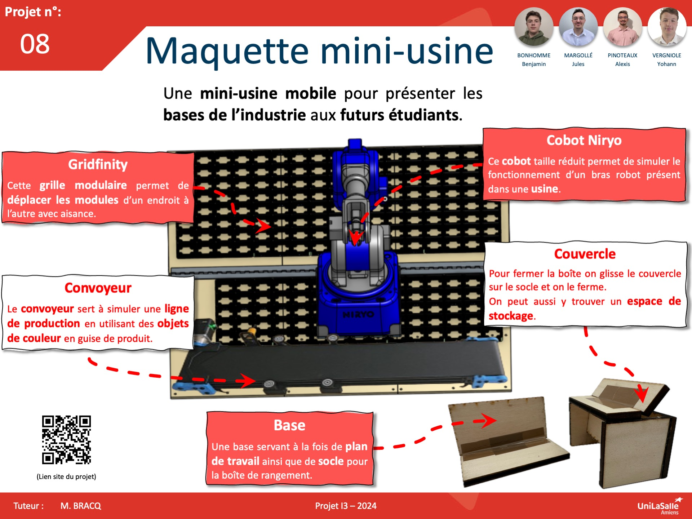

# Bienvenue sur notre documentation du projet Mini Factory

Bienvenue dans la documentation du projet Mini Factory Model. Ce site a pour but de fournir toutes les informations nécessaires pour comprendre, utiliser et reproduire efficacement notre projet.

## À propos du Projet

Le but principal de la chaîne de production serait de trier des objets en fonction des formes et/ou des couleurs en utilisant le bras robotisé. Nous désirons créer une interface logicielle afin de pouvoir contrôler la maquette.

Le but de notre projet serait donc de réaliser une maquette de chaîne de tri transportable sur les différents lieux de production. En effet, Unilasalle Amiens possède une filière PAUC (Production Automatisée et Usine Connectée) et un tel projet, pourrait permettre de faire la promotion de cette filière ou simplement de faire découvrir l’univers de la production automatisée

## Poster

<iframe width="100%" height="500" src="https://www.youtube.com/embed/1ccF_rse7Ak" frameborder="0" allow="accelerometer; autoplay; encrypted-media; gyroscope; picture-in-picture" allowfullscreen></iframe>

---
