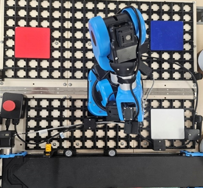
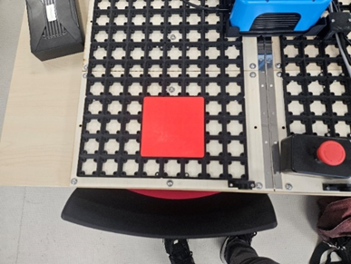
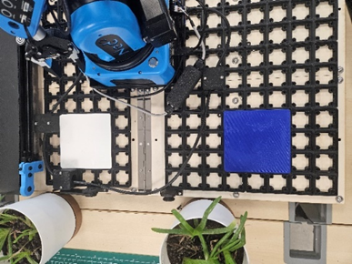

# Mise en place du module 1

## Explication du module

Ce module a pour but de trier selon les critères de formes ou de couleurs.

## Les étapes à suivre

1) Suivre les étapes de la notice « Mise en Place des Démonstrations »

2) Placer les plaques sur la grille comme sur les photos ci-dessous.

*placement globale*

*placement gauche*

*placement droite*

3) Lancer l’ordinateur et le logiciel NiryoStudio.

4) Sélectionner dans la liste « mes derniers programmes » le programme voulu (uniquement les programmes commençant par « Module_1_VF ») et le lancer.

S’il n’apparaît pas, aller dans l’onglet « Blockly » présent dans la liste à gauche et appuyer sur le bouton « Ouvrir » en haut à droite. Puis sélectionner le programme voulu.
