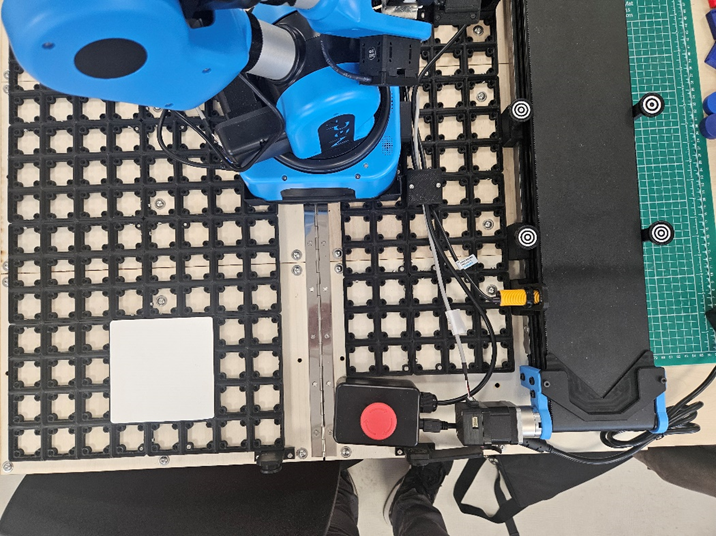
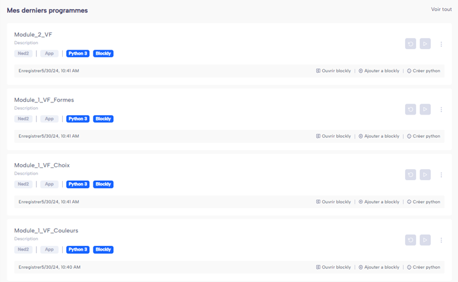

# Mise en place du module 2

## Explication du module :

Ce module a pour but de récupérer un objet sur une position définie puis de l’amener à une autre position définie elle aussi.

## Les étapes à suivre :

1) Suivre les étapes de la notice « Mise en Place des Démonstrations »

2) Placer les plaques sur la grille comme sur les photos ci-dessous (la couleur de la plaque n’est pas importante).

3) Lancer l’ordinateur et le logiciel NiryoStudio.

4) Sélectionner dans la liste mes derniers programmes le programme Module_2_VF et le lancer.

S’il n’apparaît pas, aller dans l’onglet « Blockly » présent dans la liste à gauche et appuyer sur le bouton « Ouvrir » en haut à droite. Puis sélectionner le programme voulu.

5) Mettre les objets fournis (carré et rond de couleur) au centre de la plaque puis lancer le programme

**! Attention mettre les objets un par un. !**

