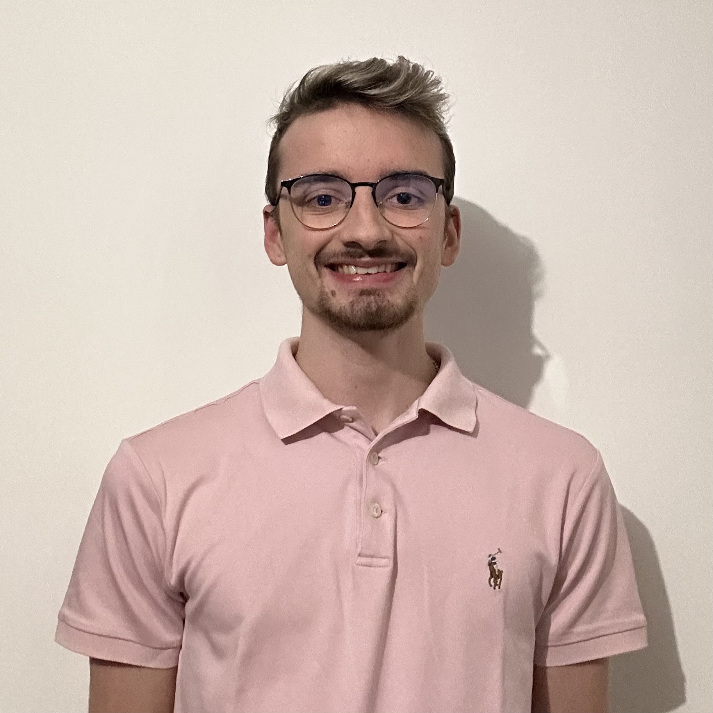
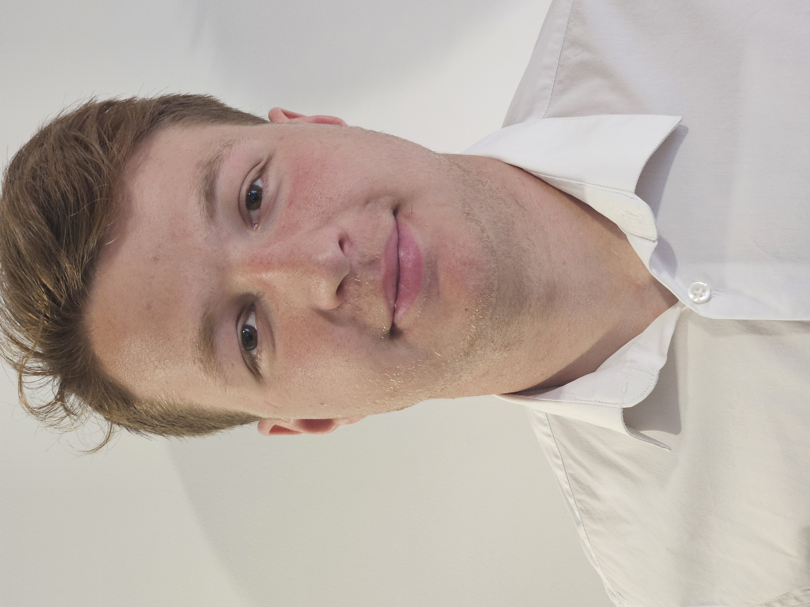

# Présentation de l'équipe

    

        
        
Benjamin BONHOMME

    

    

        
        
Jules MARGOLLÉ

    

    

        
        
Alexis PINOTEAUX

    

    

        
        
Yohann VERGNIOLE

    

Nous sommes tous les quatre étudiants à UniLaSalle Amiens en 3e année d'études d'ingénierie.
Durant cette année, nous devons réaliser un projet de groupe, le nôtre sera la conception d'une mallette de rangement pour un Cobot et ses accessoires ainsi qu'à la réalisation de programme pédagogique de son fonctionnement.

|| Programmation | Modélisation | Bricolage |
|:-:|:--:|:---:|:--:|
| Benjamin BONHOMME | 3 | 5 | 3 |
| Jules MARGOLLÉ | 5 | 5 | 3 |
| Alexis PINOTEAUX | 5 | 3 | 4 |
| Yohann VERGNIOLE | 5 | 3 | 4 |

### Attribution des rôles
- Benjamin est en charge de la modélisation 3D des accessoires de la mallette
- Jules est en charge de la modélisation 3D de la mallette
- Alexis est en charge de la gestion des matériaux et des commandes 
- Yohann est en charge de la programmation du Cobot